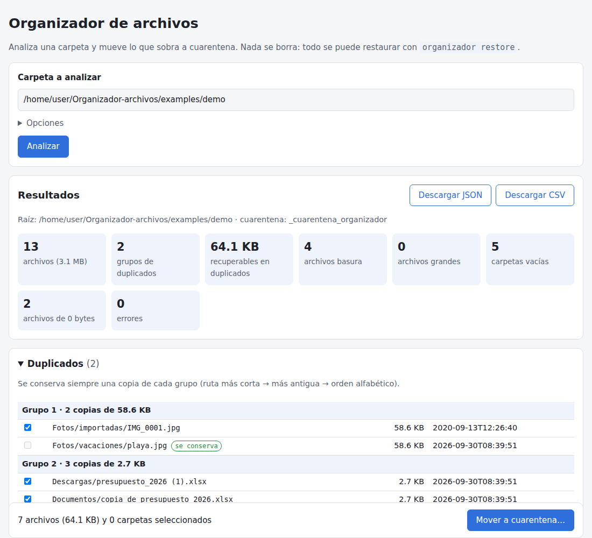

# organizador-archivos

[](https://github.com/borjaiturregui/Organizador-archivos/actions/workflows/tests.yml)


Herramienta para **analizar carpetas** (duplicados, archivos grandes, basura/temporales,
carpetas vacías, archivos de 0 bytes y enlaces duros) y **organizarlas de forma segura**:
nunca borra archivos, los mueve a una **cuarentena** reversible con `restore`.

Incluye una **CLI** y una **interfaz web local** (solo `127.0.0.1`). Pensada y probada
principalmente para **Windows**.



## Por qué es distinta

Buscadores de duplicados hay muchos. Lo que aporta esta herramienta es la **seguridad**:

1. **Informe unificado**: duplicados + grandes + basura + vacías + 0 bytes + enlaces duros.
2. **Siempre queda al menos una copia**: la regla se aplica sobre el *conjunto final* de
   archivos a mover, aunque las categorías se solapen (tres `.bak` idénticos son a la vez
   duplicados y basura: se mueven dos, nunca los tres).
3. **Copia conservada determinista** y **recalculada al aplicar**: ruta más corta → fecha
   de modificación más antigua → orden alfabético. No se confía en el informe.
4. **Revalidación antes de cada movimiento**: existencia, tamaño y fecha del archivo y de
   la copia conservada; si el motivo es "duplicado", se vuelve a comparar el contenido (SHA-256).
5. **Log por movimiento** (JSON Lines, sincronizado a disco y escrito *antes* de cada
   movimiento) y `restore` que **nunca sobrescribe** y tolera logs cortados por un apagón.
6. **Web asíncrona** con progreso, cancelación y medidas de seguridad locales.
7. **Consciente de Windows**: rutas de más de 260 caracteres, junctions/reparse points,
   mismo volumen obligatorio para la cuarentena, rutas de sistema bloqueadas.

## Instalación (Windows)

Requisitos: **Python 3.11 o superior** ([python.org](https://www.python.org/downloads/),
marca *Add python.exe to PATH*) y Git.

```powershell
git clone https://github.com/borjaiturregui/Organizador-archivos.git
cd Organizador-archivos
py -m venv .venv
.venv\Scripts\Activate.ps1
pip install -e .            # solo CLI (no instala FastAPI)
pip install -e ".[web]"     # CLI + interfaz web
```

> Si PowerShell no deja activar el entorno: `Set-ExecutionPolicy -Scope CurrentUser RemoteSigned`.

Comprueba la instalación con `organizador --version`.

## Uso de la CLI

El flujo tiene tres pasos: **analizar → aplicar → (si hace falta) restaurar**.

```powershell
# 1. Analizar (solo lee; no toca nada)
organizador analyze "C:\Users\tu-usuario\Descargas" --output informe.json --csv informe.csv

# 2. Ver qué se haría, sin mover nada
organizador apply informe.json --simular

# 3. Aplicar (pide confirmación; --yes para no preguntar)
organizador apply informe.json

# 4. Deshacer
organizador restore "C:\Users\tu-usuario\Descargas\_cuarentena_organizador\cuarentena_log_20260930-101500.jsonl"
```

### `analyze`

| Opción | Descripción |
|--------|-------------|
| `--output`, `-o` | Guarda el informe JSON (necesario para `apply`). |
| `--csv` | Guarda el informe CSV (UTF-8 con BOM, se abre bien en Excel). |
| `--umbral-grande` | A partir de qué tamaño un archivo es "grande" (por defecto `100MB`; admite `KB`, `MB`, `GB`). |
| `--exclude`, `-e` | Patrón a excluir por nombre o ruta relativa (`*.iso`, `fotos/originales`). Repetible. |
| `--sin-exclusiones-por-defecto` | No excluir `.git`, `node_modules`, `.venv`, `venv`, `__pycache__`, `$RECYCLE.BIN`… |
| `--ext-basura` | Añade extensiones basura (`--ext-basura .log,.cache`). |
| `--solo-ext-basura` | Sustituye la lista de extensiones basura. |
| `--permitir-sistema` | Permite analizar rutas de sistema (bloqueadas por defecto). |
| `--limite` | Elementos por sección en consola (el JSON/CSV siempre es completo). |

Basura por defecto: `.tmp .temp .bak .old .swp .swo .dmp .chk .crdownload .part .partial`,
`Thumbs.db`, `.DS_Store` y nombres acabados en `~`.

### `apply`

| Opción | Descripción |
|--------|-------------|
| `--yes`, `-y` | No pedir confirmación. |
| `--sin-duplicados` / `--sin-basura` | Excluye esas categorías (por defecto se aplican ambas). |
| `--grandes` | Mueve también los archivos grandes (por defecto solo se informan). |
| `--vacias` | Elimina las carpetas vacías con `rmdir` (restaurable). |
| `--cuarentena` | Otra carpeta de cuarentena; **debe estar en la misma unidad**. |
| `--simular` | Muestra el plan sin mover nada. |

Los archivos se mueven a `<carpeta analizada>\_cuarentena_organizador\` **conservando la
estructura de carpetas**. El log queda en esa misma carpeta. Pulsar `Ctrl+C` durante
`apply` cancela de forma limpia: termina el archivo en curso y lo hecho queda en el log.

### `restore`

Devuelve cada archivo a su ruta original en orden inverso y recrea las carpetas vacías
eliminadas. Si en la ruta original ya existe un archivo, **no lo sobrescribe**: lo omite
y lo indica. Genera su propio log `restauracion_log_*.jsonl`.

Si `apply` se interrumpió (cierre, apagón), `restore` ignora la última línea incompleta
del log con un aviso y restaura también los movimientos anotados como intento aunque
no llegara a confirmarse.

## Interfaz web

```powershell
organizador web            # abre http://127.0.0.1:8765 en el navegador
organizador web --puerto 9000 --no-abrir
```

1. Escribe la ruta de la carpeta y pulsa **Analizar** (se puede **cancelar**).
2. Revisa los resultados por categoría. Por defecto se marcan las copias duplicadas sobrantes
   y la basura; la copia conservada de cada grupo no se puede marcar.
3. Pulsa **Mover a cuarentena…** y confirma.
4. Descarga el informe en JSON o CSV si lo necesitas.

La cuarentena en la web es fija (`_cuarentena_organizador` dentro de la carpeta analizada).
Para restaurar se usa la CLI (`organizador restore`), cuya orden exacta aparece al terminar.

## Qué hace con cada categoría

| Categoría | Acción |
|-----------|--------|
| Duplicados (copias sobrantes) | Cuarentena; siempre queda ≥1 copia de cada grupo |
| Basura / temporales | Cuarentena (misma regla si coinciden con duplicados) |
| Archivos grandes | Solo se informan; se mueven únicamente si se pide (`--grandes` o marcándolos) |
| Archivos de 0 bytes | Sección aparte; no cuentan como duplicados entre sí |
| Carpetas vacías | `rmdir` (solo si siguen vacías), registrado y restaurable |
| Enlaces duros | Solo se informan: moverlos no libera espacio |

## Seguridad

**Del análisis y la cuarentena**

- Nunca se borra un archivo. La única eliminación es `rmdir` de carpetas vacías.
- Rutas bloqueadas por defecto: raíces de unidad (`C:\`), `C:\Windows`, `Program Files`,
  `Program Files (x86)`, `ProgramData` (y equivalentes en Linux/macOS).
- El informe JSON se trata como **dato no fiable** (se puede editar): `apply` vuelve a
  validar la raíz, rechaza rutas fuera de ella (incluidas `..` y rutas que atraviesen
  enlaces o junctions), recalcula la copia conservada y revalida cada archivo.
- La cuarentena debe estar en el **mismo volumen**: se mueve con `rename`, nunca con
  copiar+borrar. Si está en otra unidad, se rechaza.
- Los enlaces simbólicos y *junctions* no se siguen; se listan como omitidos.
- Toda cuarentena lleva un archivo `.organizador_cuarentena`, así que se excluye de los
  análisis siguientes aunque tenga un nombre personalizado (`--cuarentena`).

**De la web local**

- Escucha solo en `127.0.0.1`.
- Testigo aleatorio por arranque, incrustado en la página y enviado en la cabecera
  `X-Testigo` (no en cookie, que se compartiría con otros servicios del mismo host).
  Toda la API lo exige, también las lecturas.
- Se comprueban `Host` (contra *DNS rebinding*) y `Origin`; no hay CORS.
- `apply` solo acepta **identificadores** de resultados del análisis hecho por el propio
  servidor, nunca rutas enviadas por el navegador.
- Un único trabajo a la vez (análisis **o** apply), ambos cancelables.
- CSP estricta y los nombres de archivo se insertan como texto (sin `innerHTML`).

## Limitaciones conocidas

- Es una herramienta de un solo usuario y local; no hay autenticación ni base de datos.
- La comparación es por contenido exacto (SHA-256), no detecta imágenes "parecidas".
- La revalidación usa tamaño y fecha de modificación: un cambio que conserve ambos no se
  detecta, salvo en duplicados, donde además se compara el contenido antes de mover.
- Los archivos con enlaces duros quedan fuera de duplicados/basura/grandes (solo se informan).
- Linux y macOS funcionan, pero no se cubren todos sus casos límite.
- La interfaz web no restaura; se hace con la CLI.

## Desarrollo

```powershell
pip install -e ".[dev]"
pytest
```

Estructura:

```
src/organizador/
  analyzer.py     recorrido, clasificación y duplicados (tamaño → hash parcial → SHA-256)
  quarantine.py   plan, apply con revalidación, log y restore
  report.py       modelo del informe, JSON/CSV/texto
  rutas.py        rutas largas, reparse points, raíz y rutas de sistema
  cli.py          comandos typer
  web/            FastAPI + HTML/CSS/JS sin dependencias
tests/            analizador, cuarentena, CLI y web (TestClient)
examples/         generador de carpeta de demostración
```

El CI ejecuta los tests en **windows-latest** con Python **3.11** y **3.13**, y comprueba
que `pip install -e .` no instala FastAPI.

## Licencia

[MIT](LICENSE) © Borja Iturregui
